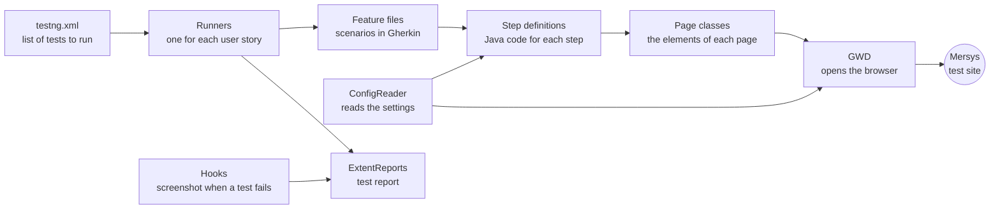

# Mersys UI Test Automation

[](https://github.com/gamzeozakinci/MersysProject/actions/workflows/ci.yml)


UI tests for the student portal of **Mersys**, a school management site. The tests open a real browser and go through login, messaging, finance, attendance, grading, assignments and the calendar. The tests are written in plain English (Gherkin) and run with Java, Selenium, Cucumber and TestNG.

**In numbers:** 25 user stories · 44 scenarios · 9 parts of the site · Chrome, Edge and Firefox · 2 bugs found on the site

## Tools

| What | Tool |
|---|---|
| Language | Java 17 |
| Control the browser | Selenium WebDriver 4.18 (Selenium Manager downloads the browser driver) |
| Write the tests | Cucumber 7.14 and Gherkin feature files |
| Run the tests | TestNG 7.8 |
| Build | Maven |
| Reports | ExtentReports |
| CI | GitHub Actions |

## What is tested

| Part of the site | Stories | What we check |
|---|---|---|
| Login | US001 | A valid login opens the dashboard. A wrong password shows an error. |
| Navigation | US002–US003 | The logo opens the Techno Study site in a new tab. All 10 top menu links open. |
| Messaging | US004–US007 | The Messaging menu. Sending a message with a receiver, text and a file, then finding it in the Outbox. Moving a message to Trash, restoring it and deleting it for good. |
| Finance | US008–US012 | Opening My Finance and the payment details. Filling in the Stripe card form. Paying a fee and downloading the report (both blocked by site bugs, see below). |
| Attendance | US013 | Sending an attendance excuse with a PDF file. |
| Profile | US014–US015 | Uploading a profile picture. Changing the theme to Purple, Dark Purple and Indigo. |
| Grading | US016–US017 | The Class Grade and Reports tabs. Opening the transcript PDF and saving it. |
| Assignments | US018–US022 | The assignment count, a discussion with a file, the quick icons, sending homework in the text editor, search, filters and sorting. |
| Calendar | US023–US025 | The weekly course plan, the tabs of a finished class, and playing a class recording. |

## Bugs found on the site

We wrote each bug down in [`docs/bug-reports/`](docs/bug-reports/). The scenarios that these bugs block are tagged `@Bug` (US010, US011 and US012). CI skips them.

| ID | What is wrong | Blocks |
|---|---|---|
| BUG-001 | A student cannot pay a fee. The Pay button stays disabled because the site asks for a page only admins can see and gets `403 Forbidden`. | US010, US011 |
| BUG-003 | The Fee/Balance Detail tab has no Excel or PDF download. | US012 |

## How the project works



- **Page Object Model.** Every page of the site has its own Java class (there are ten). The class lists the elements of that page with `@FindBy`. If the site changes, we fix one file. All page classes extend `ParentPage`, which has the shared helpers: `click`, `hover`, `mySendKeys`, `isPresent` and `pause`. For example, `click` waits until the element can be clicked, then clicks it.
- **One browser for each test.** `GWD` opens the browser and closes it after the test. The `browser` setting chooses Chrome, Edge or Firefox. On Jenkins and on GitHub Actions, Chrome runs without a window.
- **Shared test account.** The login of the shared Mersys test account is in `src/test/resources/configuration.properties`, so a fresh clone runs right away. Do not put a personal password in this file. To use another account, give the settings on the command line, for example `-Dstudent_username=...` and `-Dstudent_password=...`. A setting from the command line is used instead of the file.
- **Shared steps.** Every feature file starts with the same `Background`: open the site and log in. These steps are written once. Some steps take a value, like `User navigates to {string} page`, so many stories can use them.
- **Date range.** The Outbox, Trash and Assignments pages only show a date window around today, so older items disappear. The tests set a wide date range first (`showMessagesFromAllDates` and `widenDueDateFilter`) and check that the list is not empty. This way they keep working as the days pass.
- **Screenshots.** When a scenario fails, `Hooks` takes a screenshot, adds it to the report and saves it in `target/screenshots/`.
- **Tags and suites.** Scenarios have tags: `@Regression`, `@Smoke`, `@Negative`, `@Bug` and `@NoCI`. `@Bug` marks a scenario blocked by a known site bug. `@NoCI` marks a story that must not run on GitHub Actions, because it changes data on the site or needs the keyboard. The XML files in `src/XML_files/` run a group of stories.

## Run the tests

**You need:** JDK 17, Maven (IntelliJ IDEA has it), and Chrome, Edge or Firefox. The shared test account is already in the project.

**1. Clone the project**

```bash
git clone https://github.com/gamzeozakinci/MersysProject.git
cd MersysProject
```

**2. Run**

```bash
# All 25 stories (src/XML_files/testng.xml). This includes the @Bug scenarios, which fail.
mvn test

# Everything except the scenarios blocked by site bugs
mvn test -Dcucumber.filter.tags="not @Bug"

# What GitHub Actions runs: the ci.xml group, without @NoCI and @Bug
mvn test -DsuiteXmlFile=src/XML_files/ci.xml -Dcucumber.filter.tags="not @NoCI and not @Bug"

# Only the scenarios with one tag
mvn test -Dcucumber.filter.tags="@Smoke"

# One group of stories
mvn test -DsuiteXmlFile=src/XML_files/messaging.xml

# One user story
mvn test -Dtest=US021_AssignmentsRunner

# Another browser (Chrome is the default)
mvn test -Dbrowser=firefox

# Only check that every step has code. No browser, no login.
mvn test -Dcucumber.execution.dry-run=true
```

In IntelliJ IDEA you can also right-click an XML file or a runner class and choose **Run**.

**Test groups in `src/XML_files/`**

| File | Runs |
|---|---|
| `testng.xml` | All 25 stories |
| `ci.xml` | What GitHub Actions runs: US001–US004, US008, US009, US016, US018, US020, US022–US024 |
| `smoke.xml` | US001 (login) and US006 (move a message to Trash) |
| `messaging.xml` | US004–US007 |
| `finance.xml` | US008–US012 |
| `assignments.xml` | US018–US022 |
| `calendar.xml` | US023–US025 |
| `grading.xml` | US016–US017 |

## GitHub Actions

The workflow in `.github/workflows/ci.yml` runs on every push, on every pull request, and when you click **Run workflow** in the Actions tab. It has three steps:

1. **Dry run.** It checks that every step in every feature file has Java code, without opening a browser.
2. **UI tests.** It runs the stories in `src/XML_files/ci.xml` (24 scenarios) in Chrome without a window. It skips the `@NoCI` and `@Bug` scenarios.
3. **Save the results.** It keeps the HTML report and the failure screenshots as a download called `test-reports`. You find it at the bottom of the run page.

Two things keep the unsafe tests away from CI. First, `ci.xml` only lists the stories that look at the site. Second, the stories that change data or need the keyboard are tagged `@NoCI`: sending a message, moving to Trash, restoring and deleting, changing the theme or profile picture, sending an excuse or homework, discussions, and the transcript download. US025 is not in `ci.xml` yet, because it clicks a random finished class and some of them have no recording.

## Reports

| Output | Where |
|---|---|
| HTML report | `target/SparkReport/Spark.html` |
| Screenshots of failed scenarios | `target/screenshots/` (also in the HTML report) |

## Folders

```
MersysProject
├── .github/workflows/ci.yml        # GitHub Actions: dry run and UI tests from ci.xml
├── docs/bug-reports/               # The bugs we found (PDF)
├── pom.xml
└── src
    ├── XML_files/                  # testng.xml and the smaller test groups
    └── test
        ├── java
        │   ├── pages/              # Page classes and ParentPage
        │   ├── stepDefinitions/    # Java code for the steps
        │   ├── runners/            # One runner for each user story
        │   └── utilities/          # GWD (browser), ConfigReader, Hooks
        └── resources
            ├── features/           # 25 feature files; files/ has the files we upload
            ├── configuration.properties   # Browser, site address and the shared test login
            └── extent.properties          # Report settings
```
