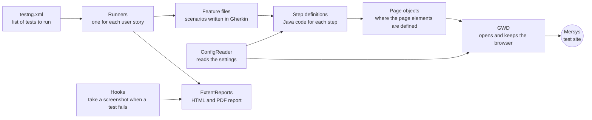

# Mersys UI Test Automation

[](https://github.com/gamzeozakinci/MersysProject/actions/workflows/ci.yml)


End-to-end UI test automation for the student portal of **Mersys**, a school management platform. The tests drive a real browser through login, messaging, finance, attendance, grading, assignments and the class calendar. Scenarios are written in Gherkin (BDD) and automated with Java, Selenium WebDriver, Cucumber and TestNG.

**At a glance:** 44 scenarios · 24 of 25 user stories automated · 9 app modules · Chrome, Edge and Firefox · 1 open defect found

## Tech stack

| Area | Tools |
|---|---|
| Language | Java 17 |
| Browser automation | Selenium WebDriver 4.18 (Selenium Manager sets up the browser drivers) |
| BDD | Cucumber 7.14, Gherkin feature files |
| Test runner | TestNG 7.8 through `cucumber-testng` |
| Build | Maven, Surefire |
| Reporting | ExtentReports: Spark HTML report and PDF report |
| CI | GitHub Actions |

## What's tested

| Module | Stories | What's covered |
|---|---|---|
| Login | US001 | Valid login reaches the dashboard; wrong credentials show an error message |
| Navigation | US002–US003 | The company logo opens the Techno Study site in a new tab; all 10 top-menu links are clicked in turn (Scenario Outline) |
| Messaging | US004–US007 | The Messaging submenu in the hamburger menu (New Message, Inbox, Outbox, Trash); composing a message to a teacher with a receiver search, a rich-text body and an attachment, then finding it in the Outbox; moving a sent message to Trash; restoring it; permanent delete behind a confirmation pop-up |
| Finance | US008–US010, US012 | Opening My Finance; the Fee/Balance payment details; filling in the Stripe card form (test card) inside its iframe. Submitting a payment is blocked by [BUG-001](docs/bug-reports/) |
| Attendance | US013 | Submitting an attendance excuse with a PDF attached |
| Profile | US014–US015 | Uploading a new profile picture; switching to the Purple, Dark Purple and Indigo themes |
| Grading | US016–US017 | The Class Grade and Reports tabs and the grade list; opening the transcript PDF in a new window, saving it, and checking that the file arrives on disk |
| Assignments | US018–US022 | The assignment count badge; a discussion thread with an attachment; the quick-action icons; homework submission in the rich-text editor (text, image, table, file, draft, submit); the Send button staying disabled until a draft is saved; search, filters and sorting |
| Calendar | US023–US025 | The Weekly Course Plan with its status legend and week navigation; the tabs of a completed class; a class recording that actually plays |


## Known defects

Defects found while automating the portal are written up in [`docs/bug-reports/`](docs/bug-reports/).

| ID | Summary | Severity | Blocks |
|---|---|---|---|
| BUG-001 | A student cannot pay a fee. The Pay button stays disabled because the portal requests an admin-only endpoint as the student and is rejected with `403 Forbidden` | Critical | US010, US011 |
| BUG-002 | The Grading page has no "Course Grade" or "Student Transcript" button, so two of the US016 acceptance steps cannot be verified | Medium | US016 |
| BUG-003 | The Fee/Balance Detail tab offers no Excel or PDF export, so the report cannot be downloaded | Medium | US012 |

## Framework design



- **Page Object Model.** Every page of the site has its own Java class (there are ten). The class only lists the elements of that page, written with `@FindBy`. If the site changes, we fix the element in one file. All page classes extend `ParentPage`, which has the shared helpers: `click`, `hover`, `mySendKeys`, `isPresent` and `pause`. For example, `click` waits until the element can be clicked, then clicks it.
- **One browser for each test thread.** `GWD` opens the browser and keeps it for the running test. It uses Chrome, Edge or Firefox, depending on the `browser` setting. On a Jenkins server, Chrome runs without a window (headless mode).
- **Passwords stay out of Git.** The test account is saved in `configuration.properties`, and Git ignores that file. `ConfigReader` reads it. You can also give a setting on the command line with `-D` (for example `-Dbrowser=firefox`), and it wins over the file. If a required setting is missing, the error message tells you what to do.
- **Shared steps.** Every feature file starts with a `Background` that opens the site and logs in, and those steps are written only once. Some steps take a value, like `User navigates to {string} page`, so many stories can reuse them.
- **Reports.** Every runner sends its results to ExtentReports. When a scenario fails, `Hooks` takes a screenshot, adds it to the report and saves a copy in `target/screenshots/`.
- **Tags.** Scenarios have tags like `@Regression`, `@Smoke` and `@Negative`, so you can run only a part of the suite.

## Technical highlights

| Challenge | How the framework handles it |
|---|---|
| Content inside iframes | Switches into the Stripe card form, the TinyMCE editor and the class-recording player, then back to the page |
| A rich-text editor | Waits for TinyMCE to initialise, then sets and reads its content through the TinyMCE JavaScript API |
| New windows and tabs | Switches to the window the app opens: checks the Techno Study URL after the logo click, and waits for the transcript PDF window to open |
| File uploads | Uses `sendKeys` on the file input where the page has one. Where the app only opens the OS file picker, `java.awt.Robot` pastes the file path from the clipboard |
| Proving a download worked | Polls `target/downloads` for up to 30 seconds until a new `.pdf` file appears |
| Proving a video plays | Reads the `paused` property of the HTML5 `<video>` element with JavaScript |
| Test data that changes every week | Picks a random assignment or class. For the calendar it steps back a week at a time, up to 10 weeks, until it finds a completed class |
| List filters that hide older data | The message lists default to a date window around today, so old messages fall out of range as time passes. The suite widens the dates first, then checks the list really filled instead of assuming it did |
| Hover menus and hard-to-click elements | Uses Selenium `Actions` for hover submenus, and a JavaScript click for elements a regular click can't reach |

## Running the tests

**You need:** JDK 17, Maven (IntelliJ IDEA includes it), Chrome, Edge or Firefox, and a Mersys student test account. Selenium Manager downloads the matching browser driver on the first run.

**1. Clone the repo and add the test account**

```bash
git clone https://github.com/gamzeozakinci/MersysProject.git
cd MersysProject
cp src/test/resources/configuration.properties.example src/test/resources/configuration.properties
```

Open `configuration.properties` and fill in `student_username` and `student_password`. The file is gitignored, so the credentials never get committed.

**2. Run**

```bash
# Full regression suite (all 25 runners in src/XML_files/testng.xml)
mvn test

# Only the scenarios with a given tag
mvn test -Dcucumber.filter.tags="@Smoke"

# A single user story
mvn test -Dtest=US021_AssignmentsRunner

# A different browser (Chrome is the default)
mvn test -Dbrowser=firefox

# Check that every step has a step definition, without opening a browser
mvn test -Dcucumber.execution.dry-run=true
```

In IntelliJ IDEA, you can also right-click `src/XML_files/testng.xml` or any runner class and choose **Run**.

> [!NOTE]
> The upload and download steps type into native Windows file dialogs with `java.awt.Robot`. Run the full suite on a Windows desktop and don't use the keyboard or mouse while it runs.

## Reports

| Output | Location |
|---|---|
| Interactive HTML report | `target/SparkReport/Spark.html` |
| PDF report | `target/PdfReport/ExtentPdf.pdf` |
| Screenshots of failed scenarios | `target/screenshots/` (also attached to the HTML report) |

## Project structure

```
MersysProject
├── .github/workflows/ci.yml          # Compile + dry-run every scenario
├── docs/bug-reports/                 # Defects found while automating
├── pom.xml
└── src
    ├── XML_files/testng.xml          # Regression suite: all 25 runners
    └── test
        ├── java
        │   ├── pages/                # Page objects + ParentPage wait helpers
        │   ├── stepDefinitions/      # Cucumber step definitions
        │   ├── runners/              # One Cucumber/TestNG runner per user story
        │   └── utilities/            # GWD (driver), ConfigReader, Hooks
        └── resources
            ├── features/             # 25 feature files; files/ holds upload fixtures
            ├── configuration.properties.example
            └── extent.properties     # Report output settings
```
